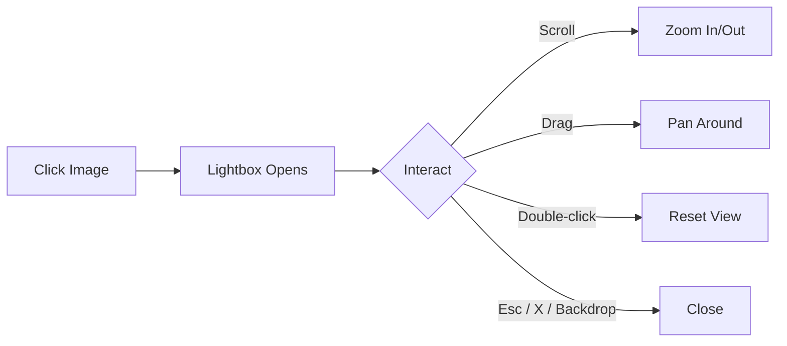
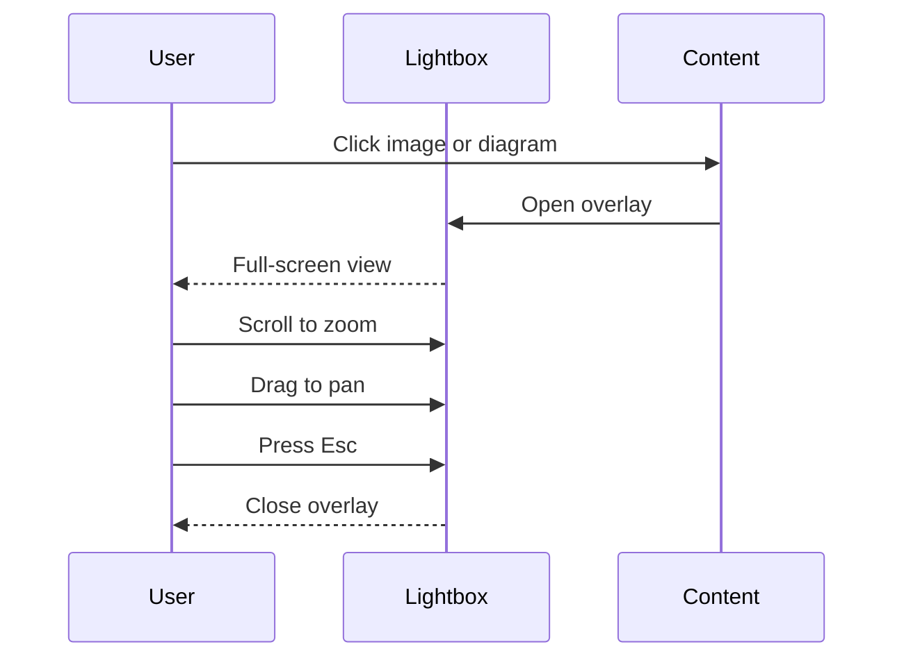

[中文](./Lightbox.zh.md) | **English**

# Lightbox

Gleaner includes a built-in lightbox for images and [[Mermaid]] diagrams. Click any image or Mermaid SVG to open a full-screen overlay with zoom and pan support.

## How It Works

- **Click** any image or Mermaid diagram to open the lightbox
- **Scroll wheel** to zoom in/out (0.5x to 5x)
- **Drag** to pan around when zoomed
- **Double-click** to reset zoom and position
- **Close** with the X button, Esc key, or click the dark backdrop

### Mobile

- **Pinch** with two fingers to zoom
- **Drag** with one finger to pan (when zoomed in)
- **Double-tap** to reset
- Tap the dark backdrop to close

## Try It

Click the image below to open the lightbox:

Click any diagram below to view it full-screen:

## Supported Content

| Content | Lightbox | Notes |
|---------|----------|-------|
| Images (``) | Yes | All image formats |
| [[Mermaid]] diagrams | Yes | All diagram types |
| Videos | No | Use native video controls |
| Math formulas | No | Inline/block math not included |
