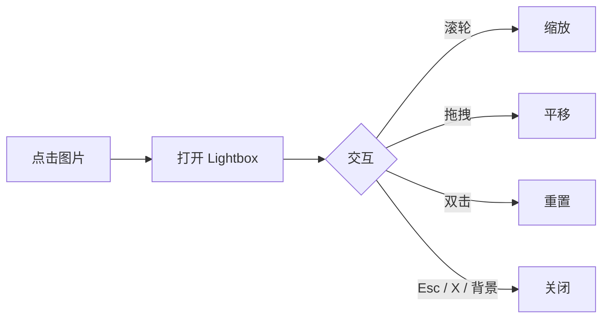
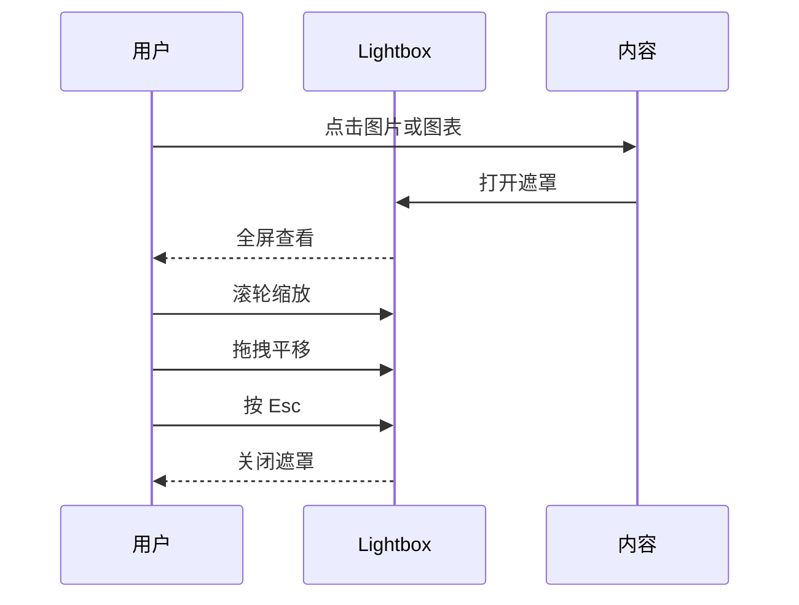

**中文** | [English](./Lightbox.md)

# Lightbox

Gleaner 内置了图片和 [[Mermaid]] 图表的 Lightbox 功能。点击任意图片或 Mermaid SVG 即可打开全屏查看，支持缩放和拖拽。

## 使用方式

- **点击** 任意图片或 Mermaid 图表打开 Lightbox
- **滚轮** 缩放（0.5x 到 5x）
- **拖拽** 平移查看大图
- **双击** 重置缩放和位置
- **关闭** 方式：X 按钮、Esc 键、点击暗色背景

### 移动端

- **双指捏合** 缩放
- **单指拖拽** 平移（放大状态下）
- **双击** 重置
- 点击暗色背景关闭

## 试一试

点击下方图片打开 Lightbox：

点击下方图表全屏查看：

## 支持的内容

| 内容 | Lightbox | 说明 |
|------|----------|------|
| 图片 (``) | 支持 | 所有图片格式 |
| [[Mermaid]] 图表 | 支持 | 所有图表类型 |
| 视频 | 不支持 | 使用原生视频控件 |
| 数学公式 | 不支持 | 行内/块级公式不包含 |
