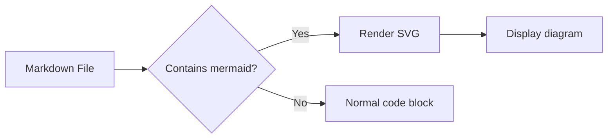
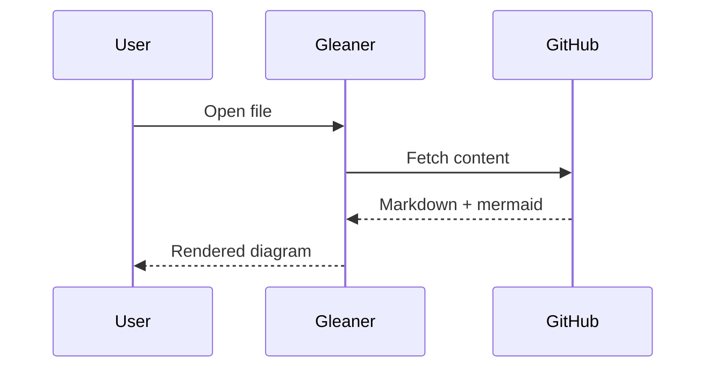
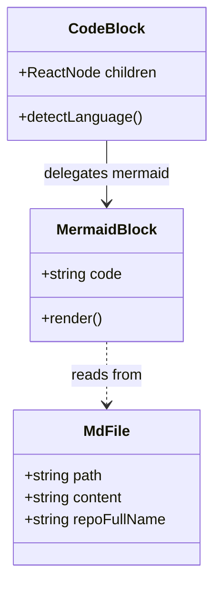
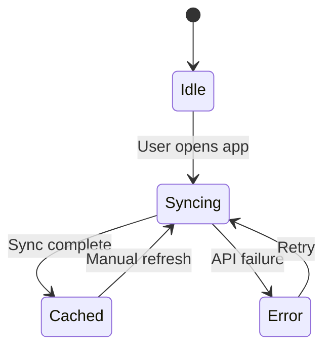
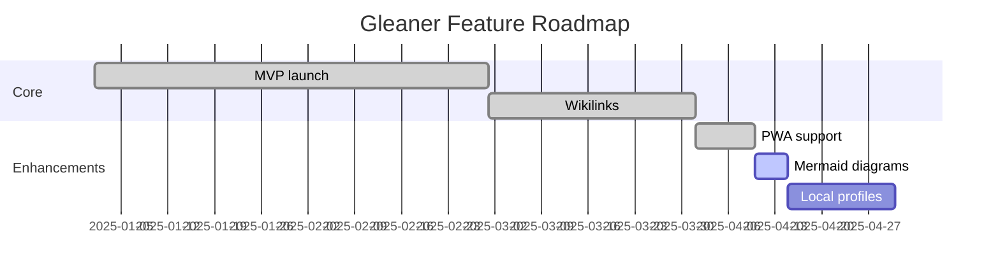
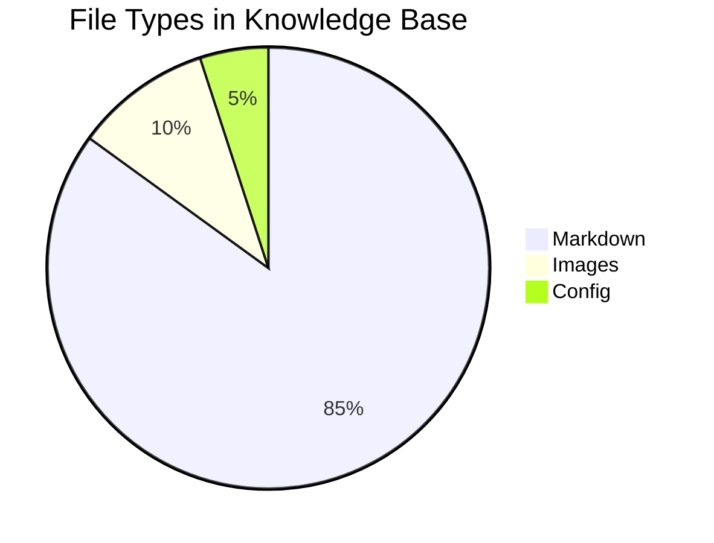
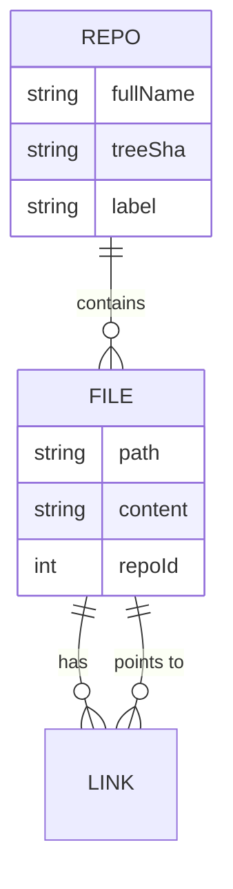

[中文](./Mermaid.zh.md) | **English**

# Mermaid Diagrams

Gleaner renders [Mermaid](https://mermaid.js.org/) code blocks as diagrams, just like Obsidian and GitHub. Diagrams follow your dark/light theme automatically.

## Flowchart



## Sequence Diagram



## Class Diagram



## State Diagram



## Gantt Chart



## Pie Chart



## Entity Relationship Diagram



## Error Handling

When a mermaid block contains invalid syntax, Gleaner falls back to displaying the raw code with an error message:

```mermaid
this is not valid mermaid syntax
  --> should show error fallback
```
