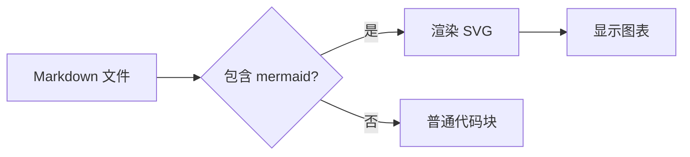
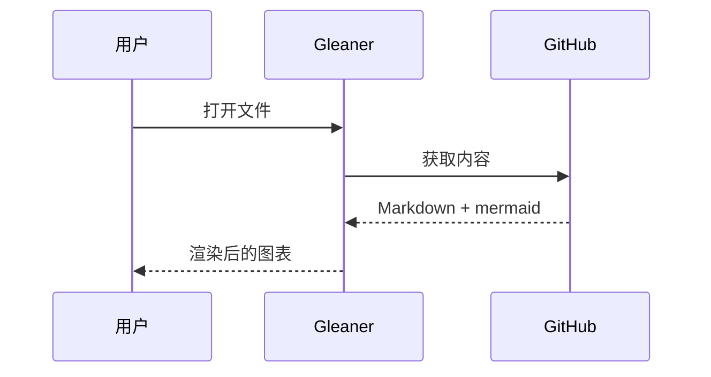
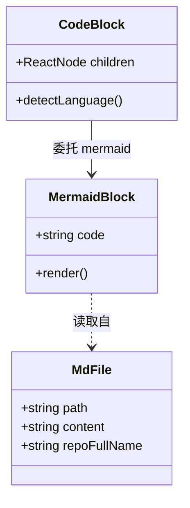
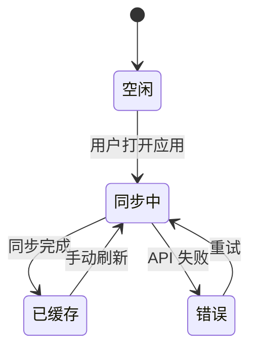
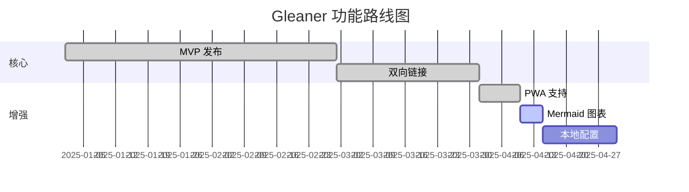
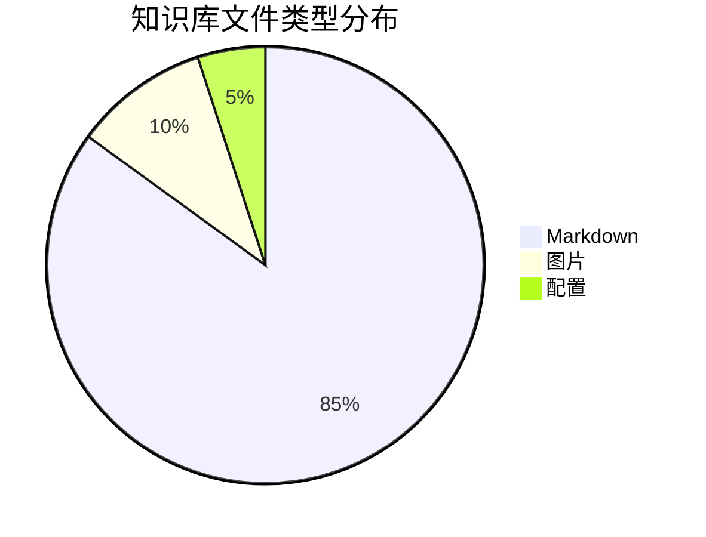
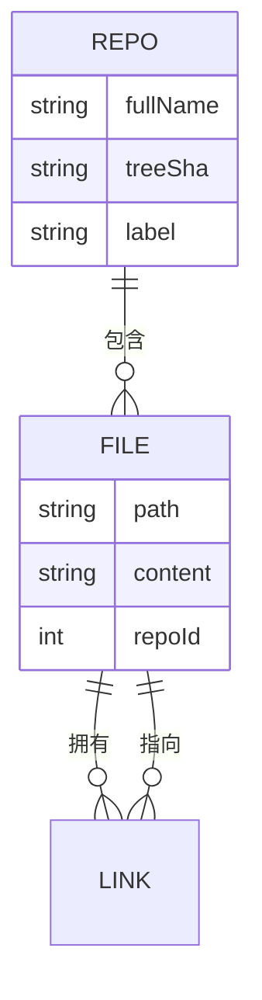

**中文** | [English](./Mermaid.md)

# Mermaid 图表

Gleaner 支持渲染 [Mermaid](https://mermaid.js.org/) 代码块为图表，与 Obsidian 和 GitHub 的行为一致。图表会自动跟随深色/浅色主题切换。

## 流程图



## 时序图



## 类图



## 状态图



## 甘特图



## 饼图



## 实体关系图



## 错误处理

当 mermaid 代码块包含无效语法时，Gleaner 会回退显示原始代码并附带错误提示：

```mermaid
这不是有效的 mermaid 语法
  --> 应该显示错误回退
```
